# Introduction to SQL

## Notes

- **SQL**: **S**tructured **Q**uery **L**anguage
- Used to manipulate and query a relational database (collection of related tables)
- `SELECT` statements are queries
- Use `SELECT` statements to double check the condition before running queries that might modify the database

## SQL Bolt Lessons

### 1. SELECT Queries 101

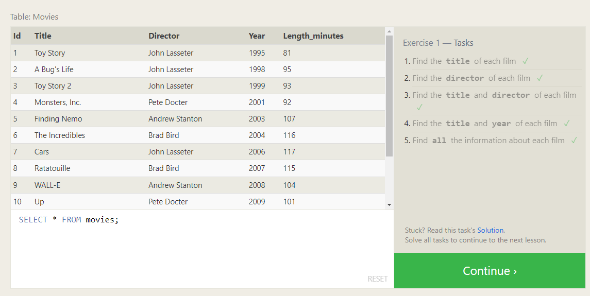

### 2. Queries with constraints (Pt. 1)

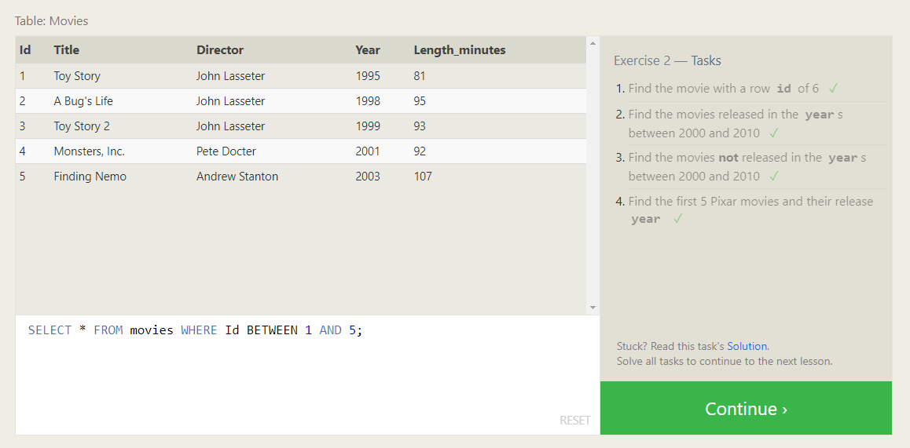

### 3. Queries with constraints (Pt. 2)

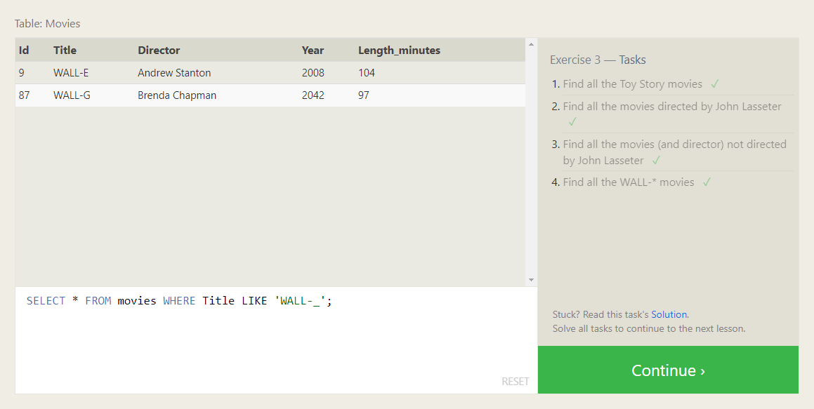

### 4. Filtering and sorting Query results

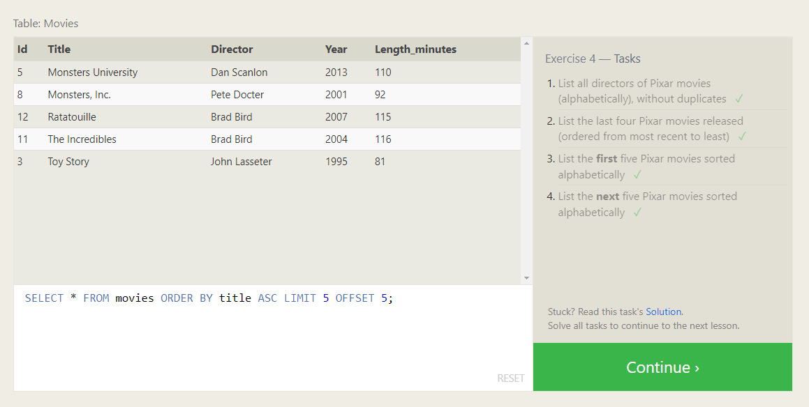

### 5. Simple SELECT Queries

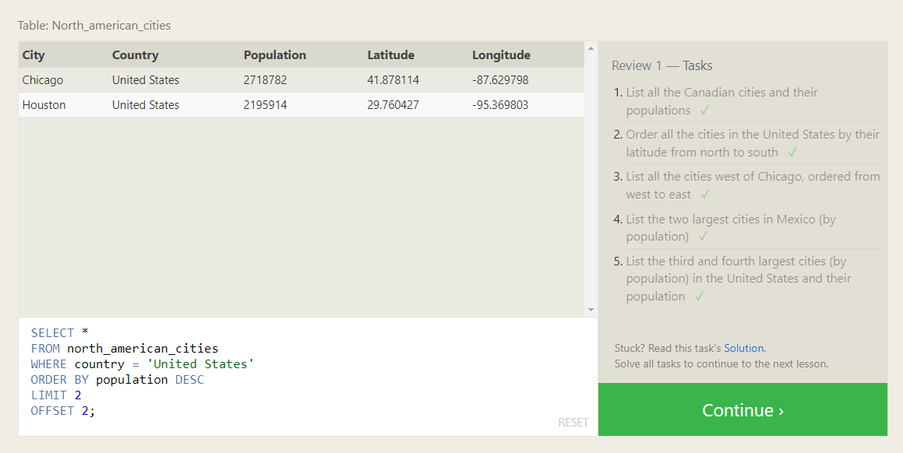

### 6. Multi-table queries with JOINs

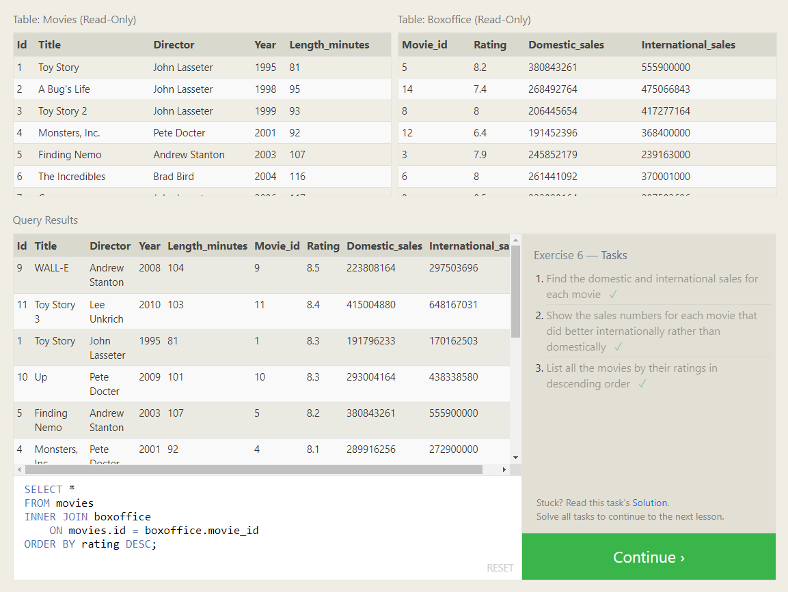

### 13. Inserting rows

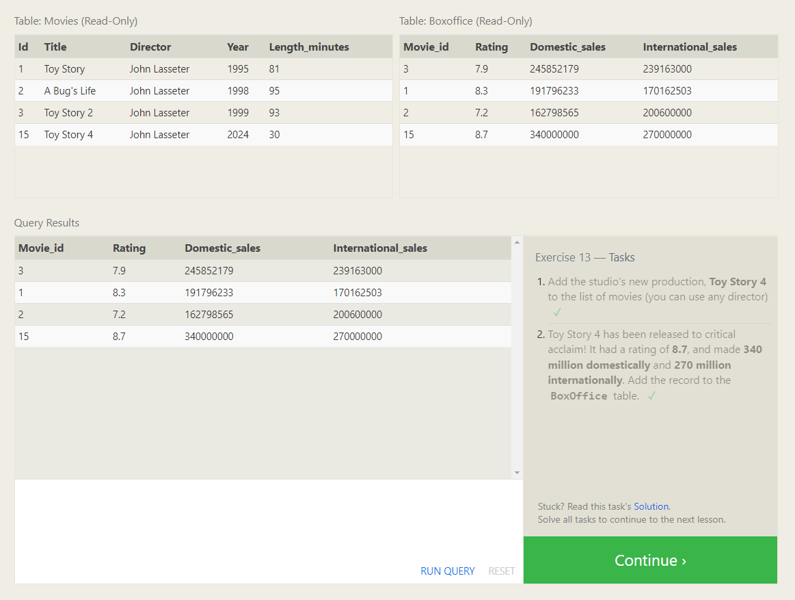

### 14. Updating rows

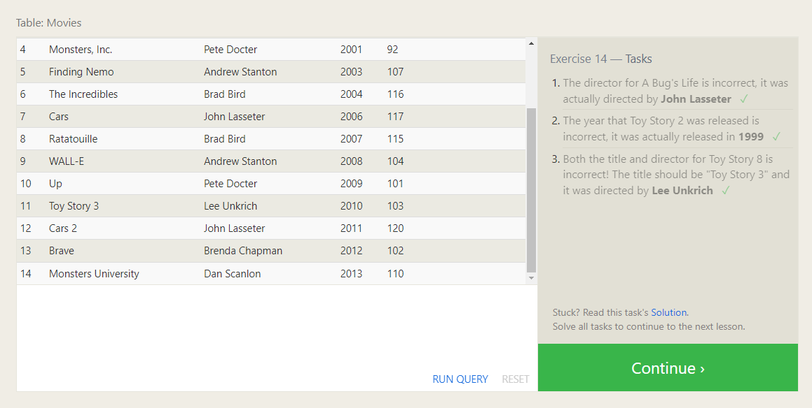

### 15. Deleting rows

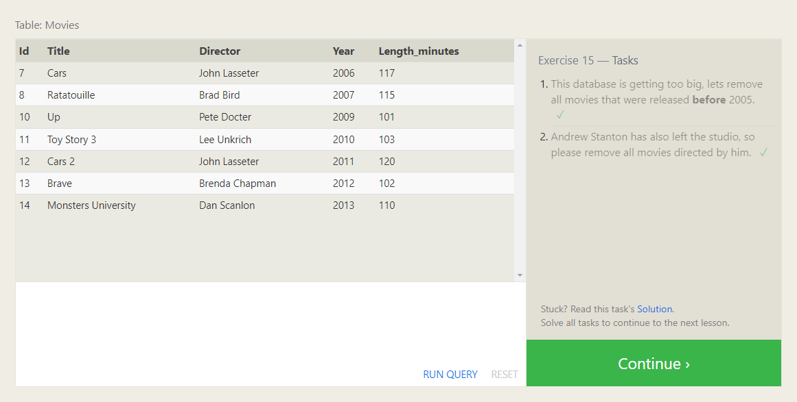

### 16. Creating tables

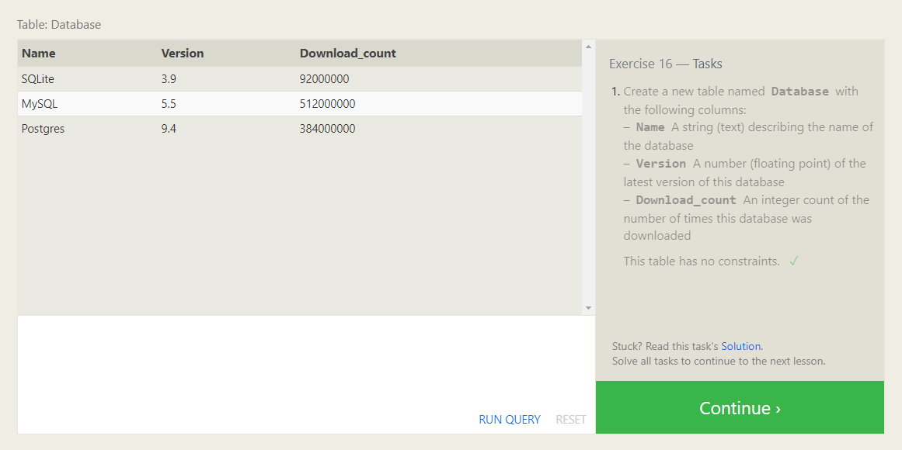

### 17. Altering tables

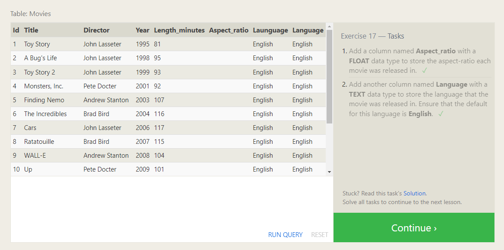

### 18. Dropping tables

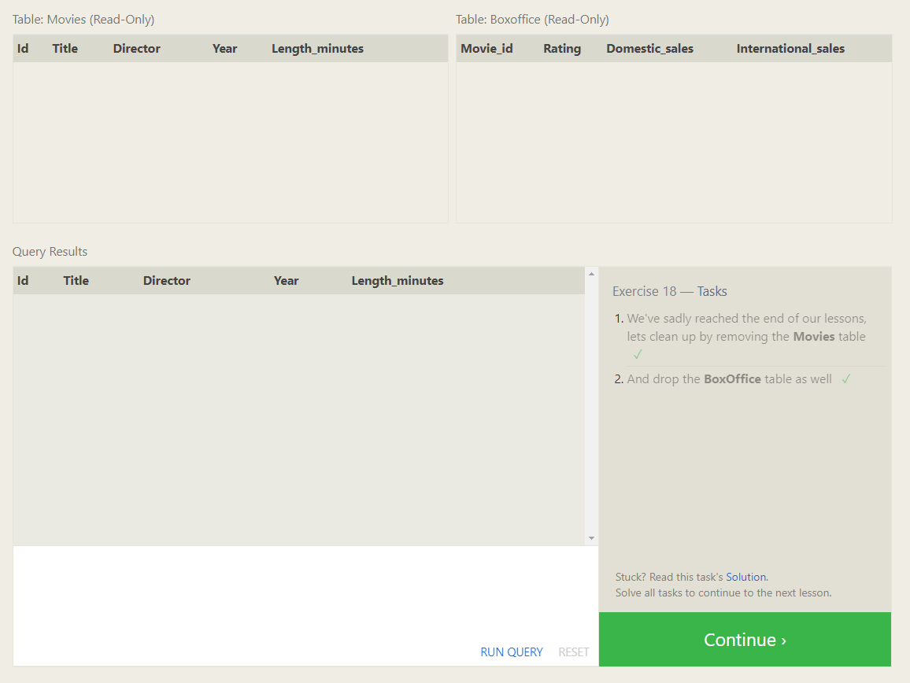

## References

- [Computer-PDF: SQL Database Tutorial for Beginners](https://www.computer-pdf.com/3-sql-database-tutorial-for-beginners)
- [SQL Bolt](https://sqlbolt.com/)
